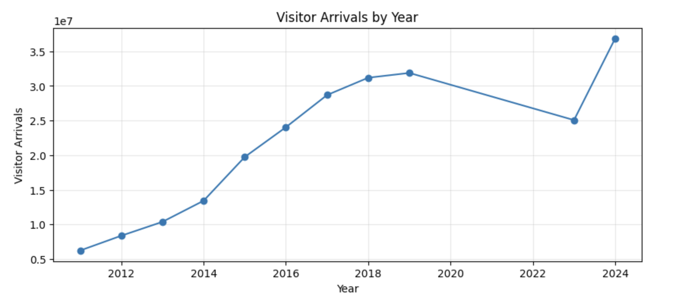

# Analysis of Inbound Tourism: FX Impact on Consumption
## Analyzed by: Passed the CPA Exam (Japan) | Tourism Data Analyst

## Overview
This project analyzes the relationship between the Japanese yen exchange rate and inbound tourism demand in Japan using official statistical data.

## Data Sources
- JNTO (Foreign Visitors to Japan)
- JNTO (Tourism Consumption)
- Bank of Japan (Exchange Rate)

## Methods
- Data preprocessing with Python (pandas)
- Correlation analysis
- Visualization
- Regression analysis

## Key Findings
- The exchange rate shows a relatively strong correlation with inbound tourism.
- Visitor arrivals and tourism consumption are moderately correlated.
- However, it is not the sole factor affecting tourism demand.

## Visualization

